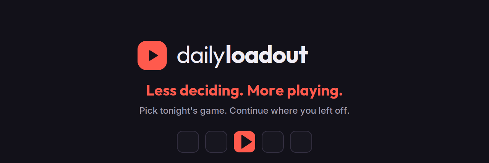

<p align="center">
  
</p>

# DailyLoadout

> *Less deciding. More playing.* A self-hosted gaming companion and production-AI systems showcase. Voice/photo/text capture, structured mission state, "previously on..." briefings before each session, and a 3-question daily loadout that picks one game for you.

[]() []() []() [](LICENSE)

---

## What problem this solves

You own 60 games. You play 2. Every time you sit down, half the session is spent deciding what to play — and when you come back to a game after 3 weeks, you've forgotten where you stopped.

DailyLoadout treats the backlog as a **decision problem**, not a cataloging problem. Three ideas:

1. **Frictionless capture.** Speak "got Hollow Knight on Switch" and the app fills the metadata. No forms.
2. **Mission briefings.** Before each session, the app generates a "previously on..." paragraph from your past debriefs — like a TV show recap.
3. **Daily Loadout.** Three quick questions (mood, time, mental energy) → one suggested game with reasoning. You don't choose; the app does.

No streaks. No "X days without playing" guilt. Dropping a game is a legitimate decision, not a failure.

---

## Why This Repo Exists

DailyLoadout is a production-style AI application wrapped in a real product I use: a full-stack, self-hosted system for turning messy player input into structured state, recommendations, and mission briefings. It runs entirely on your own hardware and uses **local LLMs via Ollama** instead of requiring cloud APIs.

This is not a prompt demo. The interesting parts are the reliability boundaries around probabilistic systems:

- **Local-first AI with provider boundaries.** The API talks to an `AbstractLLMClient`; Ollama is the real local backend and `DummyLLMClient` keeps tests deterministic. Faster-Whisper handles speech-to-text locally.
- **Structured outputs with deterministic guards.** Capture parsing, debrief extraction, and loadout picks are treated as untrusted model output. The app validates JSON shape, candidate IDs, user ownership, and context overlap before persisting or showing results.
- **Anti-hallucination as a product feature.** Briefings are checked against the user's actual mission context. Suspicious output is flagged instead of silently trusted. Loadout suggestions must reference an existing library entry; invalid UUIDs trigger a reroll path.
- **State machines for AI workflows.** Captures cross three systems (LLM, optional IGDB, user review). They're modeled as an explicit state machine (`queued → processing → review → committed/partially_committed/failed/cancelled`), making retries and partial commits safe.
- **Failure handling over happy paths.** Background debrief extraction has retry/backoff behavior and synchronous fallback before briefing generation. Capture processing degrades to review/failed states instead of corrupting the library.

The repo also includes versioned AI-engineering workflow files (`CLAUDE.md`, `.claude/`, `.mcp.json`) that document how agents, project conventions, review flows, and MCP tools are expected to work against this codebase.

### Agentic Roadmap

The next implementation track is a LangGraph-based **Deep Research Briefing**: a local SearXNG + Ollama graph that searches, grades, refines, synthesizes, spoiler-filters, and then reuses the existing anti-hallucination validator before returning a briefing. The current single-shot briefing remains the fast path and fallback.

That design is documented in [docs/DEEP_RESEARCH_BRIEFING.md](./docs/DEEP_RESEARCH_BRIEFING.md) and tracked in [ROADMAP.md](./ROADMAP.md). It is intentionally documented separately because the shipped v1 path is already useful and the LangGraph path adds long-running orchestration, bounded loops, cancellation, and graceful degradation.

---

## Quickstart

```bash
# Clone
git clone https://github.com/ranonbezerra/dailyloadout-monorepo.git
cd dailyloadout-monorepo

# Configure
cp .env.example .env
# (edit .env — defaults are sane for local dev)

# Start infrastructure
make up
```

That starts:
- **PostgreSQL 18** on `:5433`
- **Redis 7** on `:6380`
- **Ollama** on `:11434`

Then run the services on the host:

```bash
make api          # FastAPI on :8100
make web          # React on :3200
make app          # Flutter (macOS by default)
```

Open `http://localhost:3200` for the web dashboard, `http://localhost:8100/docs` for the API reference.

Run `make help` to see all available commands.

---

## Stack at a glance

| Package | Stack |
|---|---|
| `packages/api/` | Python 3.14 · FastAPI · Pydantic v2 · SQLAlchemy 2 async · PostgreSQL 18 · Redis · Taskiq · Poetry |
| `packages/app/` | Flutter 3.27+ · BLoC · go_router · dio · faster-whisper (server-side) |
| `packages/web/` | Bun · Vite · React 19 · TypeScript · Mantine v8 · TanStack Query |
| AI | `AbstractLLMClient` port · **Ollama** backend · deterministic dummy backend for tests · **faster-whisper** local |
| Infra | Docker Compose · GitHub Actions · AGPL-3.0 |

Detailed architecture in [ARCHITECTURE.md](./ARCHITECTURE.md).

---

## Features

### v1.0 (current)

- [x] Email + password auth with JWT rotation
- [x] Manual game entry (no API dependency)
- [x] Library with status workflow (backlog · playing · paused · completed · dropped)
- [x] **Capture by text** — type freely, LLM extracts game candidates
- [x] **Capture by voice** — record up to 60s, transcribed locally with faster-whisper
- [x] **Capture by photo** — single cover or shelf, processed by multimodal LLM
- [x] **IGDB enrichment** (optional) — cover art, genres, release dates
- [x] **Mission lifecycle** — start a session, write a debrief at the end
- [x] **Briefing generation** — LLM-generated "previously on..." with anti-hallucination validation
- [x] **Structured debrief extraction** — async LLM extraction of next actions, location, quest, level, and notes
- [x] **Daily Loadout** — 3 questions → 1 suggested game with reasoning
- [x] **Analytics dashboard** (web + mobile) — play heatmap, genre/platform distribution, mission timeline
- [x] Single-user mode for personal self-hosting
- [x] Mobile: iOS, Android

### In Design / Next

- [ ] **Deep Research Briefing** — LangGraph graph over local SearXNG + Ollama, with bounded search/refine loops, spoiler filtering, anti-hallucination validation, and quick-briefing fallback.
- [ ] **Backlog Concierge** — optional tool-using conversational agent over the user's real library, preserving the same UUID validation guard as Daily Loadout.
- [ ] **Cloud provider adapters** — the runtime is provider-shaped today; cloud LLM providers such as Bedrock belong behind the existing LLM port, not in product code.

### Out of scope (deliberate)

- No Steam/PSN/Nintendo API integration — backlog imports defeat the curation premise.
- No streaks, no "you haven't played in N days", no leaderboards. The tone is neutral, not aggressive.
- No social features. Not a review site, not Backloggd.
- No achievement/trophy tracking.

### Future

- Multi-device offline sync with conflict resolution
- Push notifications (paused game reminders)
- Live Activities on iOS (mission timer)
- Plugin system for custom prompts

---

## Self-hosting

The Docker Compose setup is the recommended way to run DailyLoadout. For deploying to a VPS or PaaS, see [docs/DEPLOYMENT.md](./docs/DEPLOYMENT.md) (Fly.io, Railway, Hetzner).

For Ollama model configuration and hardware requirements, see [docs/OLLAMA.md](./docs/OLLAMA.md).

---

## Development Workflow

This repo is built with AI-assisted engineering as a first-class workflow, not an afterthought:

- `CLAUDE.md` captures project architecture, safety rules, and command conventions.
- `.claude/agents/` contains role-specific agents for FastAPI, React, Flutter, architecture, testing, review, and release work.
- `.claude/skills/` captures repeatable repo-specific procedures such as API testing and Alembic migrations.
- `.mcp.json` documents MCP integration points for local development.

PRs are welcome for bug fixes, documentation, and the items on the "Future" list. For larger changes, open an issue first.

---

## License

AGPL-3.0. See [LICENSE](./LICENSE).

---

## Acknowledgements

- **IGDB** for game metadata (optional integration). "Powered by IGDB" shown in app settings when enabled.
- **Ollama** team for making local LLM deployment frictionless.
- **faster-whisper** for efficient on-device speech-to-text.
