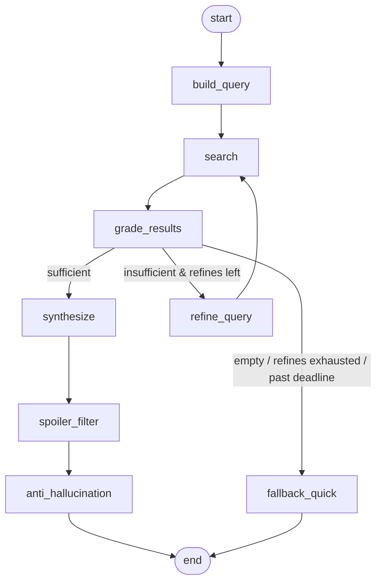

# DailyLoadout — Deep Research Briefing (LangGraph design)

Design doc for **ROADMAP Epic 10**. Companion to [ARCHITECTURE.md](../ARCHITECTURE.md)
and [PRODUCT.md](../PRODUCT.md) §3.5 (briefing flow).

This document specifies the LangGraph graph that produces a **web-grounded,
spoiler-free** mission briefing. The existing single-shot `generate_briefing`
(Epic 6) is the `quick` path and the fallback; this graph is the `deep` path.

---

## 1. Why a graph (and not more single-shot code)

Every other LLM call in DailyLoadout is single-shot for a reason: one input,
one output, deterministic guard on top. The deep briefing is different — it is
genuinely multi-step:

- it **searches** the web (a tool step),
- it must **judge** whether what came back is enough (a branch),
- if not, it **refines** the query and searches again (a bounded loop),
- it **synthesizes**, then **strips spoilers**, then **validates**,
- and it must **degrade gracefully** to the quick briefing on timeout/failure.

That is branching + looping + long-running (30–60s) + cancellation + fallback —
exactly LangGraph's territory (durable execution, conditional edges, optional
checkpointed resume). LangChain is **not** required: the nodes reuse the
existing `AbstractLLMClient`. We pull in `langgraph` only.

---

## 2. Design principles

1. **Local-first.** SearXNG + Ollama. No cloud keys. Same as the rest of the app.
2. **Deterministic guards around probabilistic nodes.** The one creative node
   (`synthesize`) is bracketed by deterministic/gated nodes: a bounded refine
   loop gated by `grade`, a `spoiler_filter` pass, and the Epic 6 token-overlap
   validator as the terminal gate.
3. **Reuse, don't duplicate.** `anti_hallucination` imports the Epic 6 validator
   from `core/mission`. It is not reimplemented.
4. **Hexagonal.** Web search and the agent are two new ports
   (`infrastructure/research/`, `infrastructure/agent/`), each with abstract
   base + real impl + dummy + factory — the same shape as `llm/`, `stt/`,
   `storage/`.
5. **Additive and reversible.** The quick path is untouched. `deep` is opt-in
   per mission start, and any failure falls back to `quick`.

---

## 3. Flow



---

## 4. Module layout

```text
infrastructure/
├── research/                 # web search port
│   ├── base.py               # AbstractResearchClient.search() / fetch()
│   ├── searxng.py            # SearxngResearchClient (local)
│   ├── dummy.py              # DummyResearchClient (canned results, tests)
│   └── factory.py            # RESEARCH_PROVIDER env
└── agent/                    # the LangGraph briefing agent
    ├── base.py               # AbstractBriefingAgent.deep_brief()
    ├── langgraph_agent.py    # LangGraphBriefingAgent (compiles + invokes)
    ├── dummy.py              # DummyBriefingAgent (tests)
    ├── factory.py            # AGENT_PROVIDER env
    └── graph/
        ├── state.py          # ResearchBriefingState (TypedDict)
        ├── nodes.py          # the 8 node functions
        └── builder.py        # StateGraph wiring + router + checkpointer

prompts/
├── research_grade.j2         # "are these results enough?" -> JSON {grade}
├── research_refine.j2        # reformulate the query
├── briefing_research.j2      # synthesize briefing from context + results
└── spoiler_filter.j2         # rewrite to directions/areas only
```

---

## 5. State schema

```python
# infrastructure/agent/graph/state.py
from __future__ import annotations

from operator import add
from typing import Annotated, Literal, TypedDict


class SearchResult(TypedDict):
    title: str
    url: str
    snippet: str


class MissionContext(TypedDict):
    game_title: str
    location: str | None
    current_quest: str | None
    next_action: str | None
    level: str | None
    previous_debriefs: list[dict[str, object]]  # same context generate_briefing uses


Grade = Literal["sufficient", "insufficient", "empty"]
Source = Literal["deep_research", "quick_fallback"]


class ResearchBriefingState(TypedDict, total=False):
    # --- inputs (set once at invocation) ---
    context: MissionContext
    deadline_ts: float                       # time.monotonic() deadline; routers compare to it

    # --- research loop working state ---
    query: str
    results: Annotated[list[SearchResult], add]   # reducer: accumulate across refine loops
    refine_count: int
    grade: Grade

    # --- synthesis + guards ---
    draft: str                               # raw synthesized briefing (may contain spoilers)
    filtered: str                            # after spoiler_filter
    overlap: float
    suspicious: bool

    # --- output ---
    briefing: str                            # final text returned to the caller
    source: Source
```

The `results` field uses the `add` reducer so each `search` pass **appends**
rather than overwrites — refining the query accumulates evidence instead of
discarding the first round.

---

## 6. Nodes

| Node | Model role | Deterministic? | Returns |
| --- | --- | --- | --- |
| `build_query` | none (or `fast`) | yes | `query`, `refine_count=0` |
| `search` | none | yes (tool) | `results` (appended) |
| `grade_results` | `fast` | LLM-gated | `grade` |
| `refine_query` | `fast` | LLM | `query`, `refine_count+1` |
| `synthesize` | `smart` | LLM (creative) | `draft` |
| `spoiler_filter` | `smart` | LLM-gated | `filtered` |
| `anti_hallucination` | none | **yes** (Epic 6 reuse) | `overlap`, `suspicious`, `briefing`, `source` |
| `fallback_quick` | `smart` | LLM (existing path) | `briefing`, `source` |

No node needs **function-calling** — `search` is a fixed step in the graph, not
a tool the LLM chooses. So `gemma3` is fine here; the tool-calling model
(`qwen3:8b`) is only relevant for the Concierge agent in Epic 11.

```python
# infrastructure/agent/graph/nodes.py  (sketch — nodes are bound to deps in builder.py)
import json
import time

import structlog

from dailyloadout.core.mission.validators import check_briefing_overlap  # Epic 6, reused
from dailyloadout.infrastructure.llm.base import AbstractLLMClient
from dailyloadout.infrastructure.research.base import AbstractResearchClient

from .render import render  # thin Jinja loader, same SandboxedEnvironment as ollama.py

log = structlog.get_logger()


async def build_query(state, *, llm: AbstractLLMClient) -> dict:
    ctx = state["context"]
    base = (
        f'{ctx["game_title"]} after {ctx.get("location") or ""} '
        f'{ctx.get("current_quest") or ""} next steps walkthrough spoiler-free'
    )
    return {"query": " ".join(base.split()), "refine_count": 0}


async def search(state, *, research: AbstractResearchClient, max_results: int) -> dict:
    results = await research.search(state["query"], limit=max_results)
    return {"results": results}  # reducer appends


async def grade_results(state, *, llm: AbstractLLMClient) -> dict:
    if not state["results"]:
        return {"grade": "empty"}
    prompt = render("research_grade.j2", query=state["query"],
                    results=state["results"], context=state["context"])
    raw = await llm.complete(prompt, role="fast", json=True)
    return {"grade": json.loads(raw).get("grade", "insufficient")}


async def refine_query(state, *, llm: AbstractLLMClient) -> dict:
    prompt = render("research_refine.j2", query=state["query"],
                    results=state["results"], context=state["context"])
    new_q = (await llm.complete(prompt, role="fast")).strip()
    return {"query": new_q, "refine_count": state["refine_count"] + 1}


async def synthesize(state, *, llm: AbstractLLMClient) -> dict:
    prompt = render("briefing_research.j2", context=state["context"], results=state["results"])
    return {"draft": (await llm.complete(prompt, role="smart")).strip()}


async def spoiler_filter(state, *, llm: AbstractLLMClient) -> dict:
    prompt = render("spoiler_filter.j2", draft=state["draft"], context=state["context"])
    return {"filtered": (await llm.complete(prompt, role="smart")).strip()}


async def anti_hallucination(state) -> dict:
    ctx = state["context"]
    grounding = _context_text(ctx) + " " + " ".join(r["snippet"] for r in state["results"])
    overlap, suspicious = check_briefing_overlap(output=state["filtered"], context=grounding)
    text = state["filtered"]
    if suspicious:
        text += "\n\n_(Heads up: this recap drifted from your notes — take it loosely.)_"
    return {"overlap": overlap, "suspicious": suspicious,
            "briefing": text, "source": "deep_research"}


async def fallback_quick(state, *, llm: AbstractLLMClient) -> dict:
    ctx = state["context"]
    text = await llm.generate_briefing(
        game_title=ctx["game_title"],
        previous_debriefs=ctx["previous_debriefs"],
        current_next_action=ctx.get("next_action"),
    )
    return {"briefing": text, "source": "quick_fallback"}
```

---

## 7. Edges & routing

```python
# infrastructure/agent/graph/builder.py
import time
from functools import partial

from langgraph.checkpoint.memory import MemorySaver
from langgraph.graph import END, START, StateGraph

from . import nodes
from .state import ResearchBriefingState


def route_after_grade(state, *, max_refines: int) -> str:
    if time.monotonic() > state["deadline_ts"]:
        return "fallback_quick"
    grade = state["grade"]
    if grade == "sufficient":
        return "synthesize"
    if grade == "insufficient" and state["refine_count"] < max_refines:
        return "refine_query"
    return "fallback_quick"  # empty, or refines exhausted


def build_graph(*, llm, research, settings):
    g = StateGraph(ResearchBriefingState)

    g.add_node("build_query", partial(nodes.build_query, llm=llm))
    g.add_node("search", partial(nodes.search, research=research,
                                 max_results=settings.deep_briefing_max_results))
    g.add_node("grade_results", partial(nodes.grade_results, llm=llm))
    g.add_node("refine_query", partial(nodes.refine_query, llm=llm))
    g.add_node("synthesize", partial(nodes.synthesize, llm=llm))
    g.add_node("spoiler_filter", partial(nodes.spoiler_filter, llm=llm))
    g.add_node("anti_hallucination", nodes.anti_hallucination)
    g.add_node("fallback_quick", partial(nodes.fallback_quick, llm=llm))

    g.add_edge(START, "build_query")
    g.add_edge("build_query", "search")
    g.add_edge("search", "grade_results")
    g.add_conditional_edges(
        "grade_results",
        partial(route_after_grade, max_refines=settings.deep_briefing_max_refines),
        {"synthesize": "synthesize", "refine_query": "refine_query", "fallback_quick": "fallback_quick"},
    )
    g.add_edge("refine_query", "search")        # the bounded loop
    g.add_edge("synthesize", "spoiler_filter")
    g.add_edge("spoiler_filter", "anti_hallucination")
    g.add_edge("anti_hallucination", END)
    g.add_edge("fallback_quick", END)

    return g.compile(checkpointer=MemorySaver())
```

The loop `search → grade_results → refine_query → search` is bounded by
`refine_count < max_refines` (default 2) **and** by the wall-clock deadline
check at the top of the router. Two independent stops; the loop cannot run away.

---

## 8. The two guards, as nodes

- **`spoiler_filter`** (new). A `smart`-model rewrite constrained to suggest
  **directions and areas only** — never boss names, plot twists, story beats,
  or item locations the player has not already mentioned. The prompt receives
  the player's own context so it knows what is "already known" vs. a spoiler.
- **`anti_hallucination`** (reused, Epic 6). The terminal gate. It tokenizes
  the filtered output for proper nouns + numbers and checks ≥70% overlap with
  the grounding text (player's own words **plus** the retrieved snippets). Below
  threshold → `suspicious=True` and a disclaimer is appended. This is the
  **same** function used by the quick path; importing it keeps one source of
  truth for "what counts as drift."

Optional deterministic backstop (v1.1++): maintain a per-game blocklist of
high-risk proper nouns harvested from results and assert none survive the
filter unless they appear in the player's own context. Start without it; the
LLM filter + overlap gate are enough for v1.

---

## 9. Checkpointing, cancellation, deadline

- **Checkpointer:** start with `MemorySaver` (zero infra). Upgrade to
  `AsyncPostgresSaver` against the existing PostgreSQL 18 when you want durable
  resume and run inspection — matches the repo's "YAGNI until then" stance.
- **Thread id:** use `mission.public_id` as the `thread_id` so a given mission's
  deep-briefing run is addressable (resume, cancel, inspect).
- **Two-layer deadline:**
  1. *Inside the graph* — `route_after_grade` checks `time.monotonic()` against
     `deadline_ts` and routes to `fallback_quick` if exceeded.
  2. *Around the graph* — the service wraps `ainvoke` in
     `asyncio.wait_for(..., timeout=deadline + 5)` as a hard ceiling, in case a
     single node hangs (e.g., Ollama stalls mid-generation).

---

## 10. Ports & service integration

```python
# infrastructure/agent/base.py
from abc import ABC, abstractmethod
from dataclasses import dataclass

from .graph.state import MissionContext


@dataclass
class DeepBriefRequest:
    context: MissionContext
    thread_id: str


@dataclass
class BriefResult:
    text: str
    source: str          # "deep_research" | "quick_fallback"
    suspicious: bool


class AbstractBriefingAgent(ABC):
    @abstractmethod
    async def deep_brief(self, req: DeepBriefRequest) -> BriefResult: ...
```

```python
# infrastructure/agent/langgraph_agent.py
import time

from .base import AbstractBriefingAgent, BriefResult, DeepBriefRequest
from .graph.builder import build_graph


class LangGraphBriefingAgent(AbstractBriefingAgent):
    def __init__(self, *, llm, research, settings) -> None:
        self._graph = build_graph(llm=llm, research=research, settings=settings)
        self._deadline = settings.deep_briefing_deadline_seconds

    async def deep_brief(self, req: DeepBriefRequest) -> BriefResult:
        init = {"context": req.context, "deadline_ts": time.monotonic() + self._deadline}
        cfg = {"configurable": {"thread_id": req.thread_id}}
        final = await self._graph.ainvoke(init, config=cfg)
        return BriefResult(
            text=final["briefing"],
            source=final["source"],
            suspicious=final.get("suspicious", False),
        )
```

```python
# core/mission/service.py  (excerpt — layer discipline preserved: service calls the port)
import asyncio
from typing import Literal


async def start_mission(self, *, library_entry_id, mode: Literal["quick", "deep"] = "quick"):
    mission = await self._missions.create(library_entry_id=library_entry_id, ...)
    ctx = self._build_context(mission)   # location/quest/next_action + last 3 debriefs

    if mode == "deep" and self._agent is not None:
        try:
            result = await asyncio.wait_for(
                self._agent.deep_brief(
                    DeepBriefRequest(context=ctx, thread_id=str(mission.public_id))
                ),
                timeout=self._settings.deep_briefing_deadline_seconds + 5,  # hard ceiling
            )
            briefing = result.text
        except (asyncio.TimeoutError, ResearchUnavailable):
            briefing = await self._quick_briefing(ctx)   # existing generate_briefing + Epic 6 guard
    else:
        briefing = await self._quick_briefing(ctx)

    await self._missions.set_briefing(mission.id, briefing)
    return mission, briefing
```

Note the small addition to the LLM port: a generic
`complete(prompt: str, *, role: Literal["fast", "smart"], json: bool = False) -> str`
so agent nodes can render their own Jinja prompts. `OllamaClient` already has
the private `_call_generate`; expose a thin public wrapper that maps `role` to
`OLLAMA_FAST_MODEL` / `OLLAMA_SMART_MODEL`. `DummyLLMClient.complete` returns
canned strings per prompt marker for tests.

---

## 11. Environment variables

```env
# Agent / research (Epic 10)
AGENT_PROVIDER=dummy                  # langgraph | dummy
RESEARCH_PROVIDER=dummy               # searxng | dummy
SEARXNG_BASE_URL=http://localhost:8888
DEEP_BRIEFING_DEADLINE_SECONDS=60
DEEP_BRIEFING_MAX_REFINES=2
DEEP_BRIEFING_MAX_RESULTS=6
```

Defaults are `dummy` so a fresh clone and CI never need SearXNG or a model.

---

## 12. Dependencies

- `langgraph` + `langgraph-checkpoint` (graph runtime + MemorySaver).
- **Not** `langchain` / `langchain-ollama` — nodes reuse `AbstractLLMClient`.
  (`langchain-ollama` enters only in Epic 11 for `ChatOllama.bind_tools`.)
- SearXNG as a Docker service (no external search keys).

---

## 13. Testing

- **Node unit tests.** Each node in isolation with `DummyLLMClient` +
  `DummyResearchClient`. Assert the dict it returns.
- **Router tests.** `route_after_grade` for: sufficient, insufficient+refines
  left, insufficient+exhausted, empty, past-deadline.
- **Graph integration test.** Full `ainvoke` with dummies: happy path
  (sufficient on first grade), refine-once-then-succeed, and refine-exhausted →
  fallback.
- **Fallback-on-timeout test.** `deadline_ts` in the past → `fallback_quick`,
  `source == "quick_fallback"`.
- **Spoiler-leak regression.** Feed a draft containing a known boss name not in
  the player's context; assert `spoiler_filter` removes it (curated fixtures).
- Coverage target ≥ 85% for `infrastructure/agent/` and `infrastructure/research/`.
  No real LLM or network in CI (both ports default to `dummy`).

---

## 14. Interview narrative

> *"How do you build a reliable agent on a local model?"* — A LangGraph state
> machine where the one creative step is bracketed by deterministic guards: a
> bounded refine loop gated by an LLM grader, a spoiler-filter pass, and a
> token-overlap validator as the terminal gate — with a hard deadline that
> routes to a simpler, always-available path when grounding fails. Stateful,
> long-running, branching, with graceful degradation, and not one line of
> fine-tuning.
