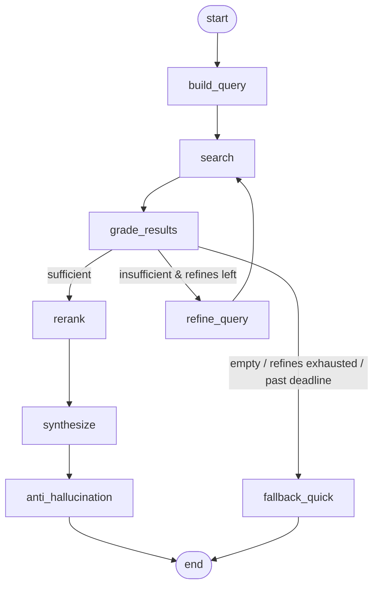

# Slate — Deep Research Recap (LangGraph design)

Design doc for **ROADMAP Epic 10**. Companion to [ARCHITECTURE.md](../ARCHITECTURE.md)
and [PRODUCT.md](../PRODUCT.md) §3.5 (recap flow).

This document specifies the LangGraph graph that produces a **web-grounded,
spoiler-free** play session recap. The existing single-shot `generate_recap`
(Epic 6) is the `quick` path and the fallback; this graph is the `deep` path.

> **Implementation status (as shipped).** Two changes landed after the original
> design; the diagrams and tables below reflect the **shipped** graph:
> 1. **No separate `spoiler_filter` node.** The spoiler rules are baked into the
>    single synthesis prompt (`recap_research.j2`) — one spoiler-aware pass
>    instead of synthesize-then-rewrite, so nothing dilutes the draft before the
>    terminal gate.
> 2. **A `rerank` node was added (Epic 25)** between `grade_results` and
>    `synthesize`: it reorders retrieved results by task relevance (`fast` role),
>    writing a `ranked_results` view that `synthesize` prefers (and scrapes
>    first). Deadline-aware and flag-gated; degrades to raw order.
> 3. **An `auto` recap mode was added (Epic 29, Corrective/Adaptive RAG).** Beyond
>    the `quick`/`deep` split below, `auto` grades whether the player's retrieved
>    local history is rich enough to ground a faithful recap and routes `quick`/`deep`
>    itself — staying `quick` for a new game with no history (cold-start cost guard)
>    and never auto-escalating a free-tier user to the paid `deep` path (entitlement
>    gate). The routing is a pure decision layer (`core/play_session/adaptive.py`);
>    this deep graph is unchanged — `auto` just decides whether to enter it.
>
> The code (`infrastructure/agent/graph/`) is authoritative; the per-node code
> blocks below are illustrative sketches.

---

## 1. Why a graph (and not more single-shot code)

Every other LLM call in Slate is single-shot for a reason: one input,
one output, deterministic guard on top. The deep recap is different — it is
genuinely multi-step:

- it **searches** the web (a tool step),
- it must **judge** whether what came back is enough (a branch),
- if not, it **refines** the query and searches again (a bounded loop),
- it **synthesizes**, then **strips spoilers**, then **validates**,
- and it must **degrade gracefully** to the quick recap on timeout/failure.

That is branching + looping + long-running (30–60s) + cancellation + fallback —
exactly LangGraph's territory (durable execution, conditional edges, optional
checkpointed resume). LangChain is **not** required: the nodes reuse the
existing `AbstractLLMClient`. We pull in `langgraph` only.

---

## 2. Design principles

1. **Local-first.** SearXNG + Ollama. No cloud keys. Same as the rest of the app.
2. **Deterministic guards around probabilistic nodes.** The one creative node
   (`synthesize`) is bracketed by deterministic/gated nodes: a bounded refine
   loop gated by `grade`, a relevance `rerank` of the grounding before synthesis
   (Epic 25), a spoiler-aware synthesis prompt, and the Epic 6 token-overlap
   validator as the terminal gate.
3. **Reuse, don't duplicate.** `anti_hallucination` imports the Epic 6 validator
   from `core/play-session`. It is not reimplemented.
4. **Hexagonal.** Web search and the agent are two new ports
   (`infrastructure/research/`, `infrastructure/agent/`), each with abstract
   base + real impl + dummy + factory — the same shape as `llm/`, `stt/`,
   `storage/`.
5. **Additive and reversible.** The quick path is untouched. `deep` is opt-in
   per play session start, and any failure falls back to `quick`.

---

## 3. Flow



---

## 4. Module layout

```text
infrastructure/
├── research/                 # web search port
│   ├── base.py               # AbstractResearchClient.search() / fetch()
│   ├── searxng.py            # SearxngResearchClient (local)
│   ├── dummy.py              # DummyResearchClient (canned results, tests)
│   └── factory.py            # RESEARCH_PROVIDER env
└── agent/                    # the LangGraph recap agent
    ├── base.py               # AbstractRecapAgent.deep_recap()
    ├── langgraph_agent.py    # LangGraphRecapAgent (compiles + invokes)
    ├── dummy.py              # DummyRecapAgent (tests)
    ├── factory.py            # AGENT_PROVIDER env
    └── graph/
        ├── state.py          # ResearchRecapState (TypedDict)
        ├── nodes.py          # the 8 node functions
        ├── render.py         # thin Jinja loader (SandboxedEnvironment + udata fence)
        └── builder.py        # StateGraph wiring + router + checkpointer

prompts/
├── research_grade.j2         # "are these results enough?" -> JSON {grade}
├── research_refine.j2        # reformulate the query
├── research_rerank.j2        # order results by task relevance -> JSON {order} (Epic 25)
└── recap_research.j2         # spoiler-aware synthesis from context + results + scraped pages
```

---

## 5. State schema

```python
# infrastructure/agent/graph/state.py
from __future__ import annotations

from operator import add
from typing import Annotated, Literal, TypedDict


class SearchResultDict(TypedDict):
    title: str
    url: str
    snippet: str


class PlaySessionContext(TypedDict, total=False):
    game_title: str
    location: str | None
    current_quest: str | None
    next_action: str | None
    level: str | None
    previous_wrap_ups: list[dict[str, object]]  # same context generate_recap uses


Grade = Literal["sufficient", "insufficient", "empty"]
Source = Literal["deep_research", "quick_fallback"]


class ResearchRecapState(TypedDict, total=False):
    # --- inputs (set once at invocation) ---
    context: PlaySessionContext
    deadline_ts: float                       # time.monotonic() deadline; routers compare to it

    # --- research loop working state ---
    query: str
    results: Annotated[list[SearchResultDict], add]  # reducer: accumulate across refine loops
    ranked_results: list[SearchResultDict]   # rerank output (plain overwrite); synthesize prefers this
    refine_count: int
    grade: Grade

    # --- synthesis + guards ---
    draft: str                               # the single spoiler-aware synthesis output
    scraped_text: str                        # full page text fed to synthesis; also grounds the guard
    overlap: float
    suspicious: bool

    # --- output ---
    recap: str                               # final text returned to the caller
    source: Source
```

The `results` field uses the `add` reducer so each `search` pass **appends**
rather than overwrites — refining the query accumulates evidence instead of
discarding the first round. `ranked_results` is a **plain-overwrite** key (not
the reducer): `rerank` replaces the ordering once, after grading, so it must not
accumulate.

---

## 6. Nodes

| Node | Model role | Deterministic? | Returns |
| --- | --- | --- | --- |
| `build_query` | none (or `fast`) | yes | `query`, `refine_count=0` |
| `search` | none | yes (tool) | `results` (appended) |
| `grade_results` | `fast` | LLM-gated | `grade` |
| `refine_query` | `fast` | LLM | `query`, `refine_count+1` |
| `rerank` | `fast` | LLM-gated | `ranked_results` (top-N by relevance; Epic 25) |
| `synthesize` | `smart` | LLM (creative) | `draft`, `scraped_text` (spoiler-aware; scrapes top results) |
| `anti_hallucination` | none | **yes** (Epic 6 reuse) | `overlap`, `suspicious`, `recap`, `source` |
| `fallback_quick` | `smart` | LLM (existing path) | `recap`, `source` |

No node needs **function-calling** — `search` is a fixed step in the graph, not
a tool the LLM chooses. So `gemma3` is fine here; the tool-calling model
(`qwen3:8b`) is only relevant for the let_me_carry agent in Epic 11.

```python
# infrastructure/agent/graph/nodes.py  (sketch — nodes are bound to deps in builder.py)
import json
import time

import structlog

from slate.core.play_session.anti_hallucination import validate_recap  # Epic 6, reused
from slate.infrastructure.llm.base import AbstractLLMClient
from slate.infrastructure.research.base import AbstractResearchClient

from .render import render  # thin Jinja loader, same SandboxedEnvironment as ollama.py

log = structlog.get_logger()


async def build_query(state, *, llm: AbstractLLMClient) -> dict:
    ctx = state["context"]
    base = (
        f'{ctx["game_title"]} after {ctx.get("location") or ""} '
        f'{ctx.get("current_quest") or ""} next steps walkthrough spoiler-free'
    )
    return {"query": " ".join(base.split()), "refine_count": 0}


async def search(state, *, research: AbstractResearchClient, max_results: int) -> dict:
    results = await research.search(state["query"], limit=max_results)
    return {"results": results}  # reducer appends


async def grade_results(state, *, llm: AbstractLLMClient) -> dict:
    if not state["results"]:
        return {"grade": "empty"}
    prompt = render("research_grade.j2", query=state["query"],
                    results=state["results"], context=state["context"])
    raw = await llm.complete(prompt, role="fast", json=True)
    return {"grade": json.loads(raw).get("grade", "insufficient")}


async def refine_query(state, *, llm: AbstractLLMClient) -> dict:
    prompt = render("research_refine.j2", query=state["query"],
                    results=state["results"], context=state["context"])
    new_q = (await llm.complete(prompt, role="fast")).strip()
    return {"query": new_q, "refine_count": state["refine_count"] + 1}


async def rerank(state, *, llm: AbstractLLMClient, enabled=True, top_n=4) -> dict:
    results = state.get("results", [])
    if not enabled or len(results) <= 1 or time.monotonic() > state["deadline_ts"]:
        return {}  # degrade: keep raw order
    prompt = render("research_rerank.j2", results=results, context=state["context"])
    order = json.loads(await llm.complete(prompt, role="fast", json=True)).get("order", [])
    return {"ranked_results": _reorder(results, order)[:top_n]}  # missing indices appended


async def synthesize(state, *, llm: AbstractLLMClient,
                     research=None, scrape_top_n=0) -> dict:
    # spoiler rules live in recap_research.j2 (single pass — no separate filter node).
    results = state.get("ranked_results") or state.get("results", [])
    pages = [...]  # optionally fetch top-N result bodies for richer grounding
    prompt = render("recap_research.j2", context=state["context"], results=results, pages=pages)
    draft = (await llm.complete(prompt, role="smart")).strip()
    return {"draft": draft, "scraped_text": " ".join(p["content"] for p in pages)}


async def anti_hallucination(state, *, threshold=0.4) -> dict:
    ctx = state["context"]
    grounding = (_context_text(ctx) + " "
                 + " ".join(r["snippet"] for r in state.get("results", []))
                 + " " + state.get("scraped_text", ""))
    result = validate_recap(state["draft"], grounding, threshold=threshold)
    # Text stays clean; the caller surfaces `suspicious` as a discreet note.
    return {"overlap": result.overlap_ratio, "suspicious": result.is_suspicious,
            "recap": state["draft"], "source": "deep_research"}


async def fallback_quick(state, *, llm: AbstractLLMClient) -> dict:
    ctx = state["context"]
    text = await llm.generate_recap(
        game_title=ctx["game_title"],
        previous_wrap_ups=ctx["previous_wrap_ups"],
        current_next_action=ctx.get("next_action"),
    )
    return {"recap": text, "source": "quick_fallback"}
```

---

## 7. Edges & routing

```python
# infrastructure/agent/graph/builder.py
import time
from functools import partial

from langgraph.checkpoint.memory import MemorySaver
from langgraph.graph import END, START, StateGraph

from . import nodes
from .state import ResearchRecapState


def route_after_grade(state, *, max_refines: int) -> str:
    if time.monotonic() > state["deadline_ts"]:
        return "fallback_quick"
    grade = state["grade"]
    if grade == "sufficient":
        return "synthesize"  # maps to the "rerank" node below (rerank → synthesize)
    if grade == "insufficient" and state["refine_count"] < max_refines:
        return "refine_query"
    return "fallback_quick"  # empty, or refines exhausted


def build_graph(*, llm, research, settings):
    g = StateGraph(ResearchRecapState)

    g.add_node("build_query", partial(nodes.build_query, llm=llm))
    g.add_node("search", partial(nodes.search, research=research,
                                 max_results=settings.deep_recap_max_results))
    g.add_node("grade_results", partial(nodes.grade_results, llm=llm))
    g.add_node("refine_query", partial(nodes.refine_query, llm=llm))
    g.add_node("rerank", partial(nodes.rerank, llm=llm,
                                 enabled=settings.deep_recap_rerank_enabled,
                                 top_n=settings.deep_recap_rerank_top_n))
    g.add_node("synthesize", partial(nodes.synthesize, llm=llm, research=research,
                                     scrape_top_n=settings.deep_recap_scrape_top_n))
    g.add_node("anti_hallucination",
               partial(nodes.anti_hallucination, threshold=settings.deep_recap_overlap_threshold))
    g.add_node("fallback_quick", partial(nodes.fallback_quick, llm=llm))

    g.add_edge(START, "build_query")
    g.add_edge("build_query", "search")
    g.add_edge("search", "grade_results")
    g.add_conditional_edges(
        "grade_results",
        partial(route_after_grade, max_refines=settings.deep_recap_max_refines),
        {"synthesize": "rerank", "refine_query": "refine_query", "fallback_quick": "fallback_quick"},
    )
    g.add_edge("refine_query", "search")        # the bounded loop
    g.add_edge("rerank", "synthesize")          # Epic 25: rerank grounding, then synthesize
    g.add_edge("synthesize", "anti_hallucination")
    g.add_edge("anti_hallucination", END)
    g.add_edge("fallback_quick", END)

    return g.compile(checkpointer=MemorySaver())
```

The loop `search → grade_results → refine_query → search` is bounded by
`refine_count < max_refines` (default 2) **and** by the wall-clock deadline
check at the top of the router. Two independent stops; the loop cannot run away.

---

## 8. Rerank + the guards

- **`rerank`** (Epic 25). Between `grade_results` and `synthesize`, the `fast`
  model orders the retrieved results by task relevance and returns the top-N as
  `ranked_results`, which `synthesize` prefers (and scrapes first). Deadline-aware
  and flag-gated: disabled, past the deadline, ≤1 result, or an unparsable
  response all skip it and keep the raw order. Measured by a model-free recall@k
  A/B (`evals/rerank.py`).
- **Spoiler safety** is enforced **inside the synthesis prompt**
  (`recap_research.j2`), not as a separate rewrite node — one spoiler-aware pass
  constrained to **directions and areas only** (never boss names, plot twists,
  or item locations the player has not already mentioned), so nothing dilutes the
  draft before the terminal gate.
- **`anti_hallucination`** (reused, Epic 6). The terminal gate. It tokenizes the
  synthesized draft for proper nouns + numbers and checks token overlap
  (`deep_recap_overlap_threshold`, more tolerant than the quick path) against the
  grounding text (player's own words **plus** the retrieved snippets **plus** any
  scraped page text). Below threshold → `suspicious=True`; the recap text stays
  clean and the caller surfaces the note. This is the **same** validator the quick
  path uses — one source of truth for "what counts as drift."

Optional deterministic backstop (v1.1++): maintain a per-game blocklist of
high-risk proper nouns harvested from results and assert none survive the
filter unless they appear in the player's own context. Start without it; the
LLM filter + overlap gate are enough for v1.

---

## 9. Checkpointing, cancellation, deadline

- **Checkpointer:** start with `MemorySaver` (zero infra). Upgrade to
  `AsyncPostgresSaver` against the existing PostgreSQL 18 when you want durable
  resume and run inspection — matches the repo's "YAGNI until then" stance.
- **Thread id:** use `play_session.public_id` as the `thread_id` so a given play session's
  deep-recap run is addressable (resume, cancel, inspect).
- **Two-layer deadline:**
  1. *Inside the graph* — `route_after_grade` checks `time.monotonic()` against
     `deadline_ts` and routes to `fallback_quick` if exceeded.
  2. *Around the graph* — the service wraps `ainvoke` in
     `asyncio.wait_for(..., timeout=deadline + 5)` as a hard ceiling, in case a
     single node hangs (e.g., Ollama stalls mid-generation).

---

## 10. Ports & service integration

```python
# infrastructure/agent/base.py
from abc import ABC, abstractmethod
from dataclasses import dataclass

from .graph.state import PlaySessionContext


@dataclass
class DeepRecapRequest:
    context: PlaySessionContext
    thread_id: str


@dataclass
class RecapResult:
    text: str
    source: str          # "deep_research" | "quick_fallback"
    suspicious: bool


class AbstractRecapAgent(ABC):
    @abstractmethod
    async def deep_recap(self, req: DeepRecapRequest) -> RecapResult: ...
```

```python
# infrastructure/agent/langgraph_agent.py
import time

from .base import AbstractRecapAgent, RecapResult, DeepRecapRequest
from .graph.builder import build_graph


class LangGraphRecapAgent(AbstractRecapAgent):
    def __init__(self, *, llm, research, settings) -> None:
        self._graph = build_graph(llm=llm, research=research, settings=settings)
        self._deadline = settings.deep_recap_deadline_seconds

    async def deep_recap(self, req: DeepRecapRequest) -> RecapResult:
        init = {"context": req.context, "deadline_ts": time.monotonic() + self._deadline}
        cfg = {"configurable": {"thread_id": req.thread_id}}
        final = await self._graph.ainvoke(init, config=cfg)
        return RecapResult(
            text=final["recap"],
            source=final["source"],
            suspicious=final.get("suspicious", False),
        )
```

```python
# core/play-session/service.py  (excerpt — layer discipline preserved: service calls the port)
import asyncio
from typing import Literal


async def start_play_session(self, *, library_entry_id, mode: Literal["quick", "deep"] = "quick"):
    play_session = await self._play_sessions.create(library_entry_id=library_entry_id, ...)
    ctx = self._build_context(play_session)   # location/quest/next_action + last 3 wrap-ups

    if mode == "deep" and self._agent is not None:
        try:
            result = await asyncio.wait_for(
                self._agent.deep_recap(
                    DeepRecapRequest(context=ctx, thread_id=str(play_session.public_id))
                ),
                timeout=self._settings.deep_recap_deadline_seconds + 5,  # hard ceiling
            )
            recap = result.text
        except (asyncio.TimeoutError, ResearchUnavailable):
            recap = await self._quick_recap(ctx)   # existing generate_recap + Epic 6 guard
    else:
        recap = await self._quick_recap(ctx)

    await self._play_sessions.set_recap(play_session.id, recap)
    return play_session, recap
```

Note the small addition to the LLM port: a generic
`complete(prompt: str, *, role: Literal["fast", "smart"], json: bool = False) -> str`
so agent nodes can render their own Jinja prompts. `OllamaClient` already has
the private `_call_generate`; expose a thin public wrapper that maps `role` to
`OLLAMA_FAST_MODEL` / `OLLAMA_SMART_MODEL`. `DummyLLMClient.complete` returns
canned strings per prompt marker for tests.

---

## 11. Environment variables

```env
# Agent / research (Epic 10)
AGENT_PROVIDER=dummy                  # langgraph | dummy
RESEARCH_PROVIDER=dummy               # searxng | dummy
SEARXNG_BASE_URL=http://localhost:8888
DEEP_RECAP_DEADLINE_SECONDS=60
DEEP_RECAP_MAX_REFINES=2
DEEP_RECAP_MAX_RESULTS=6
DEEP_RECAP_SCRAPE_TOP_N=2             # fetch top-N result bodies into synthesis (0 = snippets only)
DEEP_RECAP_OVERLAP_THRESHOLD=0.25     # anti_hallucination floor (more tolerant than quick's 0.40)
DEEP_RECAP_RERANK_ENABLED=true        # Epic 25: rerank grounding before synthesis
DEEP_RECAP_RERANK_TOP_N=4             # keep top-N after reranking
```

Defaults are `dummy` so a fresh clone and CI never need SearXNG or a model.

---

## 12. Dependencies

- `langgraph` + `langgraph-checkpoint` (graph runtime + MemorySaver).
- **Not** `langchain` / `langchain-ollama` — nodes reuse `AbstractLLMClient`.
  (`langchain-ollama` enters only in Epic 11 for `ChatOllama.bind_tools`.)
- SearXNG as a Docker service (no external search keys).

---

## 13. Testing

- **Node unit tests.** Each node in isolation with `DummyLLMClient` +
  `DummyResearchClient`. Assert the dict it returns.
- **Router tests.** `route_after_grade` for: sufficient, insufficient+refines
  left, insufficient+exhausted, empty, past-deadline.
- **Graph integration test.** Full `ainvoke` with dummies: happy path
  (sufficient on first grade), refine-once-then-succeed, and refine-exhausted →
  fallback.
- **Fallback-on-timeout test.** `deadline_ts` in the past → `fallback_quick`,
  `source == "quick_fallback"`.
- **Rerank tests.** Node reorders by a scripted order and truncates to top-N;
  degrade paths (disabled, past-deadline, ≤1 result, unparsable response) leave
  the raw order; plus the model-free recall@k A/B (`evals/rerank.py`).
- **Spoiler-leak regression.** Feed results/context containing a known boss name
  not in the player's own notes; assert the spoiler-aware synthesis + overlap gate
  don't surface it (curated fixtures).
- Coverage target ≥ 85% for `infrastructure/agent/` and `infrastructure/research/`.
  No real LLM or network in CI (both ports default to `dummy`).

---

## 14. Interview narrative

> *"How do you build a reliable agent on a local model?"* — A LangGraph state
> machine where the one creative step is bracketed by deterministic guards: a
> bounded refine loop gated by an LLM grader, a relevance rerank of the grounding,
> a spoiler-aware synthesis pass, and a token-overlap validator as the terminal
> gate — with a hard deadline that routes to a simpler, always-available path when
> grounding fails. Stateful, long-running, branching, with graceful degradation,
> and not one line of fine-tuning.
